---
# You can also start simply with 'default'
theme: seriph
background: https://encrypted-tbn0.gstatic.com/images?q=tbn:ANd9GcRgUWjEsn1xt8-PCnvw1Tr_T3V_ICHRAy75FA&s
title: Text Phishing Detection Project
info: |
  ## Text Phishing Detection Project
  Presentation slides for showcasing the phishing detection model.

  Learn more about the project and its implementations.
class: text-center
drawings:
  persist: false
transition: slide-left
mdc: true
---

# Text Phishing Detection Project

A deep learning approach to detect phishing emails.

  Press Space for next page <carbon:arrow-right />

  <button @click="$slidev.nav.openInEditor" title="Open in Editor" class="slidev-icon-btn">
    <carbon:edit />
  </button>
  <a href="https://github.com/slidevjs/slidev" target="_blank" class="slidev-icon-btn">
    <carbon:logo-github />
  </a>

---
transition: fade-out
---

# Project Overview

- **Problem**: Classify email text as phishing or legitimate.
- **Features**: One column containing email texts.
- **Labels**:
  - 0: Legitimate text
  - 1: Malicious (phishing) text
- **Goal**: 
  - Learn about deep learning.
  - Develop a robust phishing detection model.

---

# Dataset Description

- **Text Column**:
  - Contains raw email text.
- **Label**:
  - Binary classification (0: legitimate, 1: phishing).

  <em>Understanding the data is key to success!</em>

---

# Baseline Model

- **TF-IDF**:
  - Applied TF-IDF for feature extraction from text data.
  - First step to understand dataset behavior.

- **Metrics**:
  - Accuracy
  - Precision
  - Recall
  - F1-Score

  

    
Baseline performance sets the foundation for improvement.

  

---

# Evaluation Metrics

| Metric       | Description                                                                 |
|--------------|-----------------------------------------------------------------------------|
| Accuracy     | Proportion of correctly classified emails.                                 |
| Precision    | Proportion of true phishing emails among all emails classified as phishing.|
| Recall       | Proportion of correctly identified phishing emails out of all phishing emails.|
| F1-Score     | Harmonic mean of precision and recall.                                     |

<chart-placeholder/>

---
layout: image-right
image: https://cover.sli.dev
---

# Model Implementations

- **Logistic Regression**:
  - Basic classification model.
  - Provides insights into feature importance.

- **Neural Network**:
  - Multi-layer perceptron model.
  - Captures non-linear relationships in data.

- **BERT**:
  - Fine-tuned transformer-based model.
  - State-of-the-art results on text classification tasks.

  

    
Exploring diverse model architectures for the best outcomes!

  

---

# Results Visualization

### Model Performance Metrics

```mermaid
graph TD
    A[TF-IDF] --> B[Accuracy: TODO%]
    A --> C[Precision: TODO%]
    A --> D[Recall: TODO%]
    A --> E[F1-Score: TODO%]

    F[Logistic Regression] --> G[Accuracy: TODO%]
    F --> H[Precision: TODO%]
    F --> I[Recall: TODO%]
    F --> J[F1-Score: TODO%]

    K[Neural Network] --> L[Accuracy: TODO%]
    K --> M[Precision: TODO%]
    K --> N[Recall: TODO%]
    K --> O[F1-Score: TODO%]

    P[BERT] --> Q[Accuracy: TODO%]
    P --> R[Precision: TODO%]
    P --> S[Recall: TODO%]
    P --> T[F1-Score: TODO%]
```

---
transition: fade-out
---

# Graphical Insights

## Accuracy Comparison

<chart-placeholder class="animate-fade-in-up" />

Precision-Recall Tradeoff Hey! 

<chart-placeholder class="animate-fade-in-up" />

---
transition: slide-up
---
# Conclusion

- TF-IDF provided initial baseline results.
- Logistic regression gave an understanding of text features.
- Neural network improved classification performance.
- BERT delivered state-of-the-art results for phishing detection.

  <strong>Conclusion:</strong> The journey from basic to advanced modeling shows the power of iteration.

---
layout: center
class: text-center 
---

# Learn More

[GitHub Repository](https://github.com/) · [Documentation](https://sli.dev) · [Showcases](https://sli.dev/resources/showcases)

<PoweredBySlidev mt-10 />
